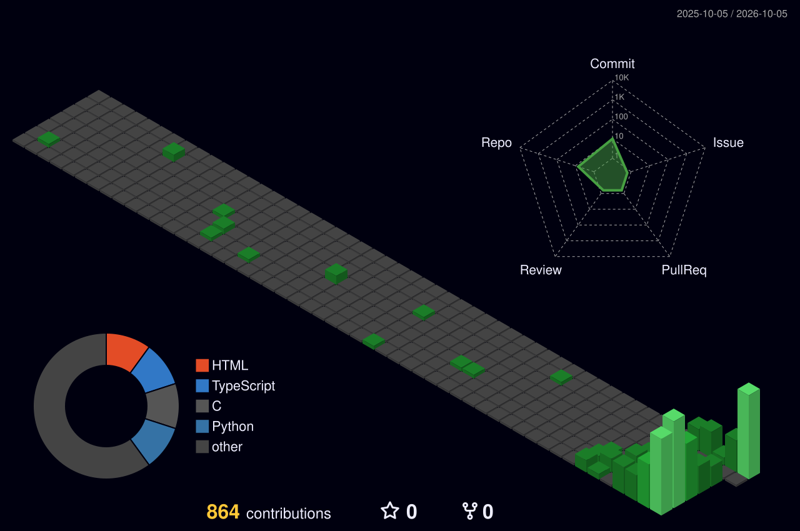

# Ryan Deelstra

**AI Engineer · Turing · Computer Science Honors @ UT Austin · Superbuilder · Founder**

I build software that feels sharp on the surface and rigorous underneath:
AI systems, consumer products, and performance-minded engineering.

---

## Background

- 🛠 AI Engineer at [Superbuilders](https://github.com/superbuilders) (Austin), 2026–present
- 🎓 Previously: AI Engineer at Alpha AI Engineering, building LLM-powered tutoring and personalized-learning tools
- 🔬 Undergraduate researcher in medical AI at UT Austin
- 🚇 Software engineer / analytics at Texas Guadaloop
- 🔊 Software engineer at UT Austin's Applied Research Laboratories: built a sonar audio codec for the Navy that beats FLAC by 4% and supports up to 65,535 channels
- 📚 Researched data compression for efficient LLM pretraining

## Connect

- 🌐 [ryandeelstra.github.io](https://ryandeelstra.github.io)
- 💼 [LinkedIn](https://www.linkedin.com/in/ryandeelstra/)

---

